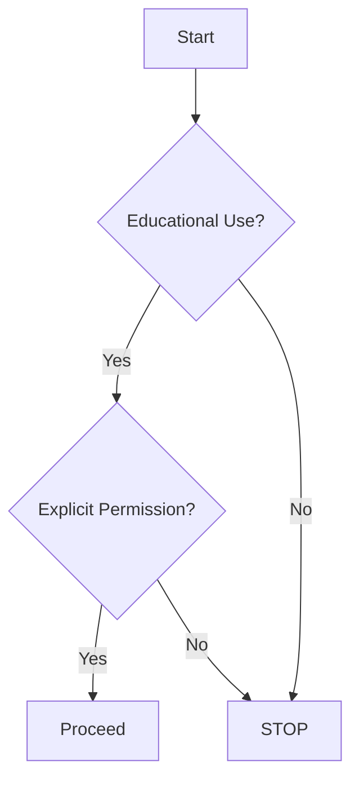

# Terms of Use and Legal Disclaimer

## 1. Purpose
This repository is intended **exclusively** for:

- Legal cybersecurity education
- Ethical hacking training
- Personal research (CTF/Bug Bounty preparation)

## 2. Prohibited Activities
### Strictly Forbidden:

- Unauthorized system testing
- Malware/exploit development
- Violations of:
   ! Computer Fraud and Abuse Act (CFAA)
   ! GDPR (for EU users)
   ! Japan's Unauthorized Computer Access Law

## 3. Legal Compliance
| Law | Relevant Section | Link |
|-----|------------------|------|
| CFAA | Section 1030 | [DOJ](https://www.justice.gov/criminal-ccips/computer-fraud-and-abuse-act) |
| GDPR | Article 5 | [EUR-Lex](https://eur-lex.europa.eu/eli/reg/2016/679) |
| UK Computer Misuse Act | Section 1 | [Legislation.gov.uk](https://www.legislation.gov.uk/ukpga/1990/18/section/1) |

## 4. Liability Disclaimer

- NO WARRANTY: Provided "AS IS"
- NO LIABILITY for damages
- Use at YOUR OWN RISK

## 5. Legal Use Flowchart

## 6. Version History
| Version | Date       | Changes            |
|---------|------------|--------------------|
| 1.0.0   | 2025-08-25 | Initial Release    |

  
