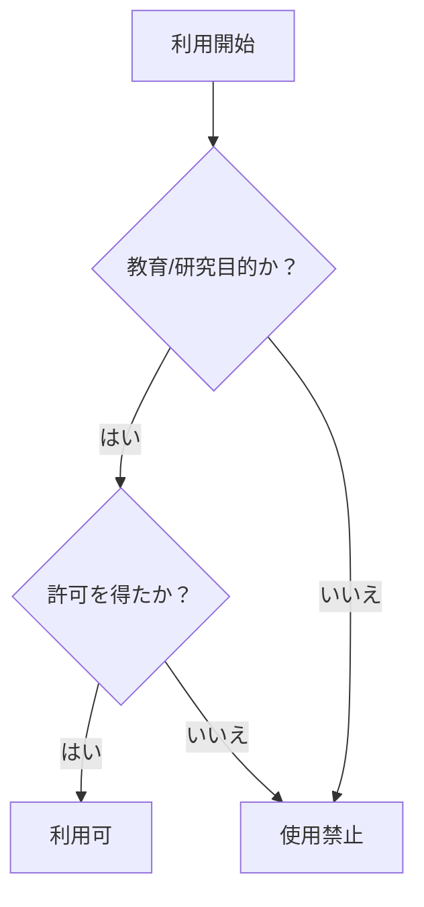

# 利用規約と免責事項

## 1. 目的と範囲
このリポジトリは、**合法的なセキュリティ教育と技術研究**を目的としており、以下の用途に限定されます:

-  教育機関での情報セキュリティ講義　
-  企業内の倫理的ハッキング研修　
- 個人のCTF/Bug Bounty対策学習　

## 2. 禁止事項
### 以下の行為を明確に禁止します:

所有者の許可がないシステムへのテスト実施　
実際の攻撃コードやマルウェアの開発　
個人情報や機密データの取得・漏洩　
以下の法律に違反する行為:
   - 不正アクセス禁止法（第3条）
   - 刑法（第234条の2）
   - 個人情報保護法

## 3. 法令遵守
### 主な関連法令

| 法律名 | 関連条文 | リンク |
|--------|----------|--------|
| 不正アクセス禁止法 | 第3条（禁止行為） | [e-Gov](https://elaws.e-gov.go.jp/document?lawid=411AC0000000128) |
| 刑法 | 第234条の2（電磁的記録不正作出） | [e-Gov](https://elaws.e-gov.go.jp/document?lawid=140AC0000000045) |
| 個人情報保護法 | 第20条（安全管理措置） | [PPC](https://www.ppc.go.jp/files/pdf/Act_on_the_Protection_of_Personal_Information.pdf) |

## 4. 免責事項
本リポジトリの利用に関して:

-  作者は一切の法的責任を負いません
-  損害が発生しても補償しません
-  利用は完全に自己責任で行ってください

## 5. 合法利用フロー

## 6. 改訂履歴
| バージョン | 更新日 | 変更内容 |
|------------|--------|----------|
| 1.0.0 | 2025-08-25 | 初版公開 |

  
